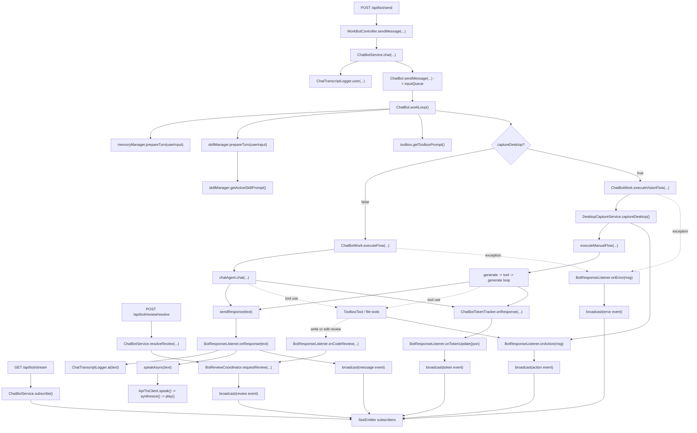
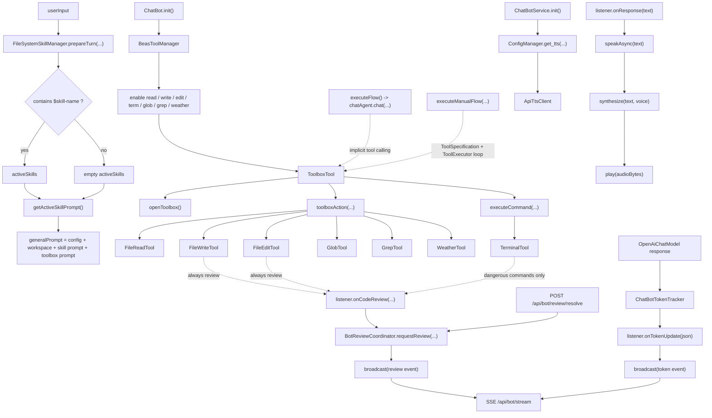

# velinx Java 后端流程图

这份文档按当前代码的实际实现整理，重点围绕 `ChatBotService`、`ChatBot`、记忆系统、工具系统和 TTS 播报来说明。

以下内容刻意保持“贴代码”而不是“理想架构图”：

- 类名、方法名、事件名直接对应当前 Java 代码。
- 图里描述的是当前运行路径，不主动替换成未来态设计。
- 如果某些回调已经预留但当前主链路没有明确生产者，会在说明里单独标注。

## 当前入口与事件

- `POST /api/bot/send`：接收用户消息，立即返回 `"success"`。
- `GET /api/bot/stream`：建立 `SseEmitter` 订阅，真正的 AI 文本和状态从这里推送。
- `POST /api/bot/review/resolve`：对工具写入/编辑触发的 review 做放行或拒绝。
- `message`：最终 AI 回复文本，以及 `onWorkflowComplete()` 中的完成提示。
- `stream`：`ChatBotService` 已支持广播该事件，但当前 `ChatBot` 主链路里没有看到明确的生产调用点。
- `action`：截图、技能激活、工具操作、命令执行等动作消息。
- `task`：`ChatBotService` 已支持广播该事件，但当前 `ChatBot` 主链路里没有看到明确的生产调用点。
- `token`：`ChatBotTokenTracker` 推送累计 token 和成本信息。
- `review`：代码写入/编辑审查请求负载。
- `error`：聊天或视觉流程中的错误消息。

## 后端流程总览

- `POST /api/bot/send` 只负责把消息送进后端队列，并不会直接把 AI 文本作为 HTTP 返回体带回来。
- 真正的 AI 文本是 `onResponse(text)` 里通过 `broadcast("message", text)` 推到 `GET /api/bot/stream` 上的。
- 普通文本路径走 `ChatBotWork.executeFlow() -> chatAgent.chat(...)`；视觉路径走 `executeVisionFlow() -> executeManualFlow()`。
- 普通文本路径的工具调用由 `AiServices + LangChain4j` 隐式处理；视觉路径在 `ChatBotWork` 里显式执行工具循环。
- `ChatBotService.onResponse()` 当前会依次做三件事：AI 日志、异步 TTS、`message` 事件广播。
- `onAction`、`onError`、`onTokenUpdate`、`onCodeReview` 都是通过 `BotResponseListener` 从核心运行时回流到 `ChatBotService`。
- `stream`、`task`、`onWorkflowComplete()` 在 service 里都有实现，但当前这条主链路里没有看到明确的触发生产点。

## 记忆流程

```mermaid
flowchart TD
    ChatInit["ChatBot.init()"] --> Features["MemoryFeatures\n(enableProfileUpdate forced false)"]
    Features --> Factory["MemoryFactory.create(...)"]

    Factory --> MemoryDir["data/<bot>/memory/"]
    Factory --> STM["ShortTermMemory"]
    Factory --> SummaryRepo["FileSummaryRepository"]
    Factory --> Summarizer["Summarizer"]
    Factory --> LTM["Hippocampus"]
    Factory --> KB["KnowledgeBaseManager"]
    Factory --> Extractor["FactCardExtractor"]
    Factory --> Manager["MemoryManager"]

    MemoryDir --> STMFile["short_term_memory.json"]
    MemoryDir --> SummaryFile["summary.txt"]
    MemoryDir --> KBFile["my_vectors.json"]
    MemoryDir --> LTMFile["vector_store.json"]
    STM --> STMFile
    SummaryRepo --> SummaryFile
    KB --> KBFile
    LTM --> LTMFile

    UserTurn["ChatBot.workLoop(userInput)"] --> Prepare["MemoryManager.prepareTurn(...)"]
    Prepare --> RetrieveFacts["hippocampus.retrieveFacts(...)"]
    Prepare --> RetrieveKB["knowledgeBase.retrieveRelevantKnowledge(...)"]
    RetrieveFacts --> TempState["tempRetrievedFacts"]
    RetrieveKB --> TempKB["tempRetrievedKnowledge"]

    TempState --> Messages["MemoryManager.messages()"]
    TempKB --> Messages
    STM --> Messages
    Summarizer --> Messages
    LTM --> Messages
    KB --> Messages
    Messages --> SystemPack["SystemMessage(summary / facts / knowledge)\n+ short-term chat history"]

    AfterTurn["afterTurn(userInput, aiResponse, model)"] --> Queue["pendingTurns + memoryExecutor"]
    Queue --> Worker["runAsyncWorker() / processBatch()"]
    Worker --> SummaryStep["processSummary(...)"]
    SummaryStep --> STMRefresh["ShortTermMemory.refresh(...)"]
    SummaryStep --> SummaryUpdate["Summarizer.updateSummary(...)"]
    Worker --> FactStep["FactCardExtractor.extractBatch(...)"]
    FactStep --> Upsert["Hippocampus.upsertFacts(...)"]
    Worker --> ProfileStep["profile.updateAiProfileByHistory(...) if enabled"]
```

- `MemoryFactory.create(...)` 负责把短期记忆、摘要、长时记忆、知识库、事实提取器和后台线程组装成一个 `MemoryManager`。
- `prepareTurn()` 只做“生成前检索”：按策略去查长时记忆和知识库，并暂存在内存状态里。
- `messages()` 会把摘要、长时记忆、知识库内容包装成 `SystemMessage`，再和短期聊天历史拼在一起交给模型。
- `afterTurn()` 不会阻塞当前回复，它只是把本轮数据塞进异步队列，让后台 worker 后续再做摘要与事实写回。
- 当前实现里，短期记忆主要落到 `data/<bot>/memory/short_term_memory.json`，摘要落到 `summary.txt`。
- 当前实现里有两类向量文件：知识库向量落到 `my_vectors.json`，长时记忆事实向量落到 `vector_store.json`。
- `MemoryFeatures` 默认会打开画像更新，但 `ChatBot.init()` 里显式把 `enableProfileUpdate` 改成了 `false`，所以当前主流程默认不会更新画像。
- 知识库导入/同步依赖 `src/main/resources/docs`，向量文件不可用时会触发重建。

## 技能、工具与说话流程

- 技能不会自动推断开启，只有用户输入里显式出现 `$skill-name` 标记时，`FileSystemSkillManager` 才会把技能指令拼进 prompt。
- 当前 `generalPrompt` 的组成是：角色基础 prompt + `Workspace` + 激活技能 prompt + toolbox prompt。
- 工具系统的入口类是 `ToolboxTool`，但底层真正执行的是 `FileReadTool`、`FileWriteTool`、`FileEditTool`、`TerminalTool`、`GlobTool`、`GrepTool`、`WeatherTool`。
- 普通文本流里的工具调用是 `AiServices` 自动调度的；视觉流里的工具调用则在 `ChatBotWork.executeManualFlow()` 中显式做 `generate -> tool -> generate` 循环。
- `FileWriteTool` 和 `FileEditTool` 会先触发 `onCodeReview(...)`；`TerminalTool` 只会对危险命令触发 review。
- review 流是阻塞式的：`BotReviewCoordinator.requestReview(...)` 会等 `POST /api/bot/review/resolve` 的结果，再决定继续还是拒绝本次修改。
- 当前 TTS 是在 `ChatBotService.init()` 里通过 `ConfigManager.get_tts(...)` 创建 `ApiTtsClient`，并在 `onResponse()` 里异步调用，不阻塞文本消息广播。
- `ChatBotTokenTracker` 绑定在 `OpenAiChatModel` 的 listener 上，负责把累计输入/输出 token 和成本转成 `token` 事件发给前端。

## 关键类职责

- `ChatBotService`：Spring service 入口，负责消息转发、SSE 广播、review 协调、TTS 异步播报。
- `ChatBot`：后端核心运行时，负责模型初始化、记忆初始化、技能/工具初始化，以及基于队列的工作线程。
- `ChatBotWork`：单轮聊天执行器，负责普通文本流、视觉流、手动工具循环和 listener 回调出口。
- `MemoryManager`：统一管理短期记忆、摘要、长时记忆、知识库检索和异步写回。
- `ToolboxTool`：模型可见的工具门面，向上暴露工具能力，向下路由到具体文件/终端/环境工具。
- `ApiTtsClient`：TTS 客户端，负责远程合成语音并在本地播放返回的音频数据。
